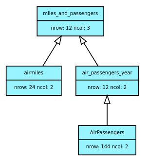

# R Data Pipeline

R code to model package, made for mapping data transformations creating CRUD operations that organizes the files and link it's source.

## how to use

first you need to declare your database directory.


``` R
library(PipeAndCrud)
database <- init_database("/path/to/data/")
```

in this example I will use two datasets found in R AirPassengers and airmiles then save in my database

``` R
library(datasets)
data(AirPassengers)
data(airmiles)
# save to database
database$save(airmiles)
database$save(AirPassengers)
```

We can access the datasets in any part of our script with 

``` R
# read from database
airmiles <- database$read("airmiles")
AirPassengers <- database$read("AirPassengers")
```

Then we will do some transformations in the datasets first transforming to data tables and summarising the AirPassagers by year


``` R
# importing data table package for this example
library(data.table)

# transforming in data tables
airmiles <- data.table(miles = c(airmiles), time = c(time(airmiles))) 

AirPassengers <- data.table(n_passengers = c(AirPassengers), time = c(time(AirPassengers))) 

# summarizing month based data by years
AirPassengers[,time := floor(time)]
air_passengers_year <- AirPassengers[, .(n_passengers = sum(n_passengers)), by=.(time)]

```

And after you created a new dataset, you can save it, specifying it's source

``` R
database$save(air_passengers_year, "AirPassengers")
```

And one last operation, we merge the datasets by year that there is a match and save it's result

``` R
miles_and_passengers <- merge(airmiles, air_passengers_year)
database$save(miles_and_passengers, c("airmiles", "air_passengers_year")) # specifying parents in second argument 
```

After this work, to keep track of our data transformations, we can plot the files created just calling

``` R
database$plot_diagram()
```
Then we'll have:



That shows to us some atributes, like the amount of rows of each dataset and it's easy to see in this case where did we lose some airmiles data.